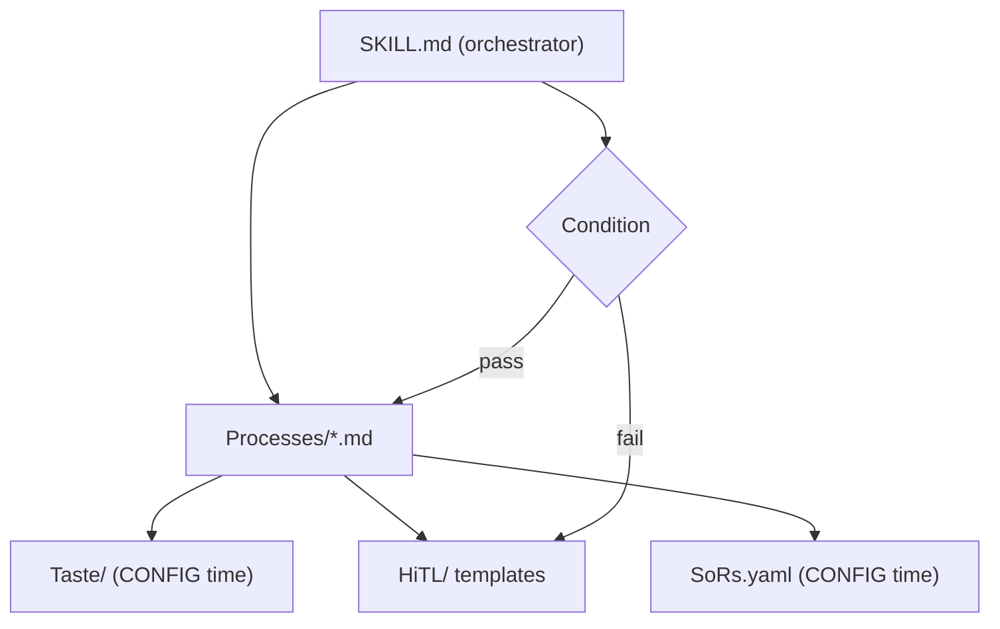

# Workflows

This repo stores agent workflows. Coding agents and go-to-market (GTM) agents both use it.

A workflow is a folder, not one file. Agents load `SKILL.md` like a skill. That file is short. It points at processes, human-in-the-loop templates, and (on your machine) systems of record and taste.

## Install

Escalations need [agenttohuman](https://github.com/TyrellD1/agenttohuman) (`a2h`). Install it, then ask your agent to configure it for you so pings work out of the box.

```bash
curl -fsSL https://raw.githubusercontent.com/TyrellD1/agenttohuman/main/install.sh | bash
```

Then tell the agent: configure a2h for me.

## Folders

- `coding/` — software work (build to spec, create spec, respond to a PR review)
- `gtm/` — go-to-market work (batch cold email, enrich lead)
- `meta/` — workflows about workflows
- `shared/` — pieces more than one workflow uses

## Add a workflow

Use `meta/create-workflow`. You can paste an idea, a spec, or a hand-drawn flow.

## How a workflow is shaped



`SoRs.yaml` and `Taste/` are templates in this repo. You fill them when you install a workflow on a machine. See `CONFIG.md` in each workflow folder. That file lists every SoR and Taste pointer so setup is surgical.
