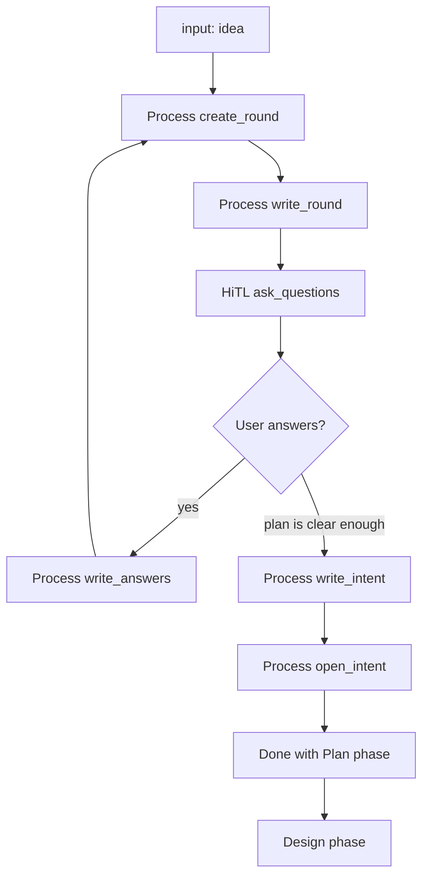

# Create spec

This workflow accepts an idea and ends with a plan file named INTENT.md.

## When it runs

- Manual: you ask an agent to turn an idea into a plan, or to create a spec from an idea.

## Before you start

- An idea (not a finished spec)
- The product repo and any docs it should read (filled at setup)

## How it works

## When a person gets involved

- Each question round (chat). Answer, or say the plan is clear enough.
- After INTENT.md is written, the file may open on your machine unless setup skips that.
