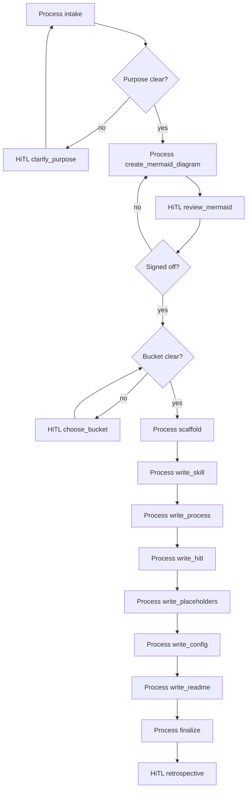

# Create workflow

This workflow accepts a workflow idea (and optionally a hand-drawn flow) and ends with a new workflow folder.

## When it runs

- Manual: you ask an agent to create a workflow, scaffold a skill-like folder, or add something under `coding/`, `gtm/`, `meta/`, or `shared/`.

## Before you start

- A name and purpose (what it accepts, what it ends with)
- Optional: a hand-drawn flow
- `a2h` installed and configured so escalations can ping you. See the root README.

## How it works

## When a person gets involved

- Purpose or bucket is unclear (a2h + chat)
- You sign off the mermaid in chat before anything else is written
- A retrospective reviews SKILL.md, Processes, CONFIG.md, and README.md
