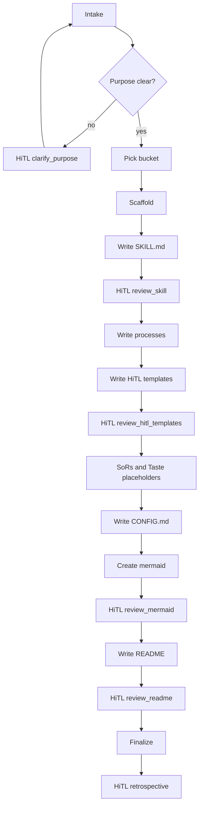

# Create workflow

This workflow accepts a workflow idea (and optionally a hand-drawn flow) and ends with a new workflow folder.

## When it runs

- Manual: you ask an agent to create a workflow, scaffold a skill-like folder, or add something under `coding/`, `gtm/`, `meta/`, or `shared/`.

## Before you start

- A name and purpose (what it accepts, what it ends with)
- Optional: a hand-drawn flow

## How it works

## When a person gets involved

- Purpose or bucket is unclear
- You approve the step list, every HiTL template, the mermaid, and the README
- A short retrospective at the end
